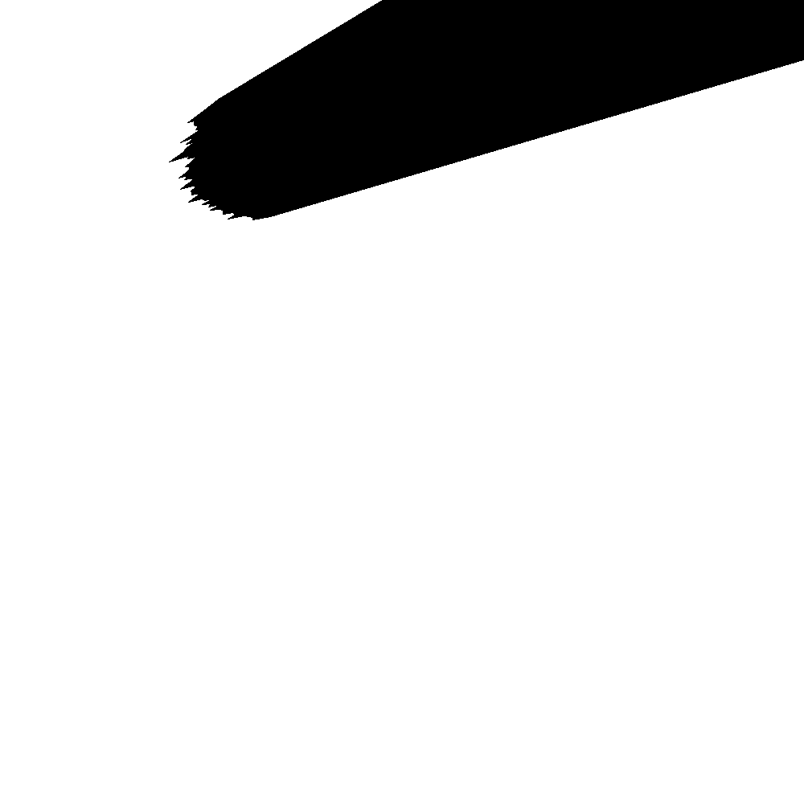
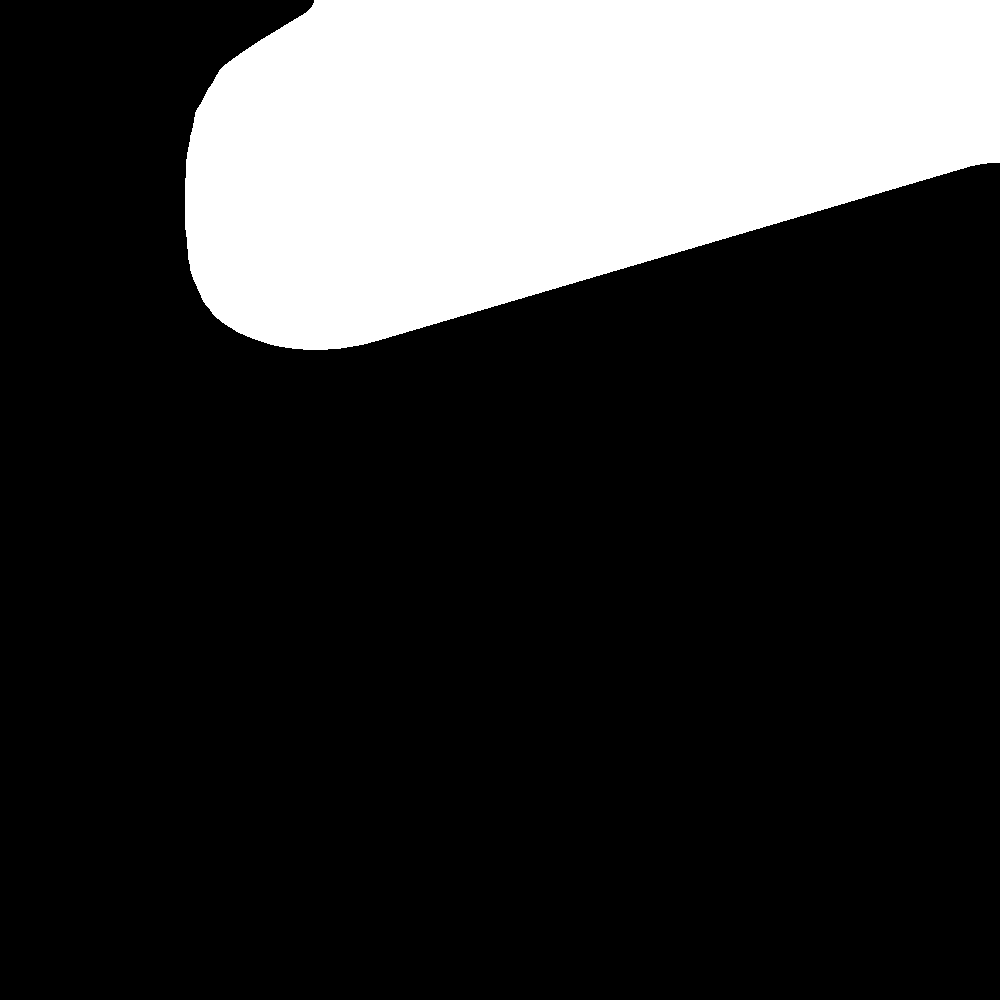
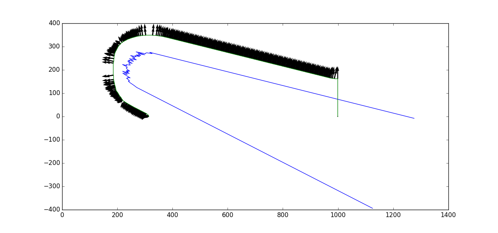

# ECE470_Project
ECE 470 Project for Chen Qian, Junkai Zhang and Zheyuan Zhang.
This project use a UR3 robot (whether in Gazebo Simulator or Reality) to spray disinfectant on certain object. The UR3 driver and model is sourced from ECE 470 Lab project and modified. [Link](http://coecsl.ece.illinois.edu/ece470/)

## Configure the environment

In linux, firstly [install ROS-Kinetic](http://wiki.ros.org/kinetic/Installation)

Then install the dependent packages that required:

[ros_control](http://wiki.ros.org/ros_control?distro=kinetic#Install) and [moveit](https://moveit.ros.org/install/)

After that, create a new folder by 

1. ```mkdir catkin_ws``` and use `cd catkin_ws` to get into the folder. Then `mkdir src` and `cd src` to create `src` folder and get into it.
2. Download the files, extract it in src folder.
3. `cd ..` to get in the root directory of catkin_ws. Use `catkin_make` to compile the whole project.
4. To run the code, firstly, `source devel/setup.bash` and launch ros by `roslaunch ur3_driver ur3_gazebo.launch` for simulator, or `roslaunch ur3_driver ur3_driver.launch` for real UR3 robot. In another window, also `source devel/setup.bash` and run the code by `rosrun CTRL_py main_exec.py`

# Our Work

Our code are mostly in the `directory /src/CTRL_py/scripts/`, but we also slightly modified the ur3 urdf file in 
`src/drivers/universal_robot/ur_description/urdf/ur3.urdf.xacro`, to install the sensors and effectors we need.

# Route generation

It could be a little tricky to convert the scanned data from Lidar to robot's route. First the scanned data of angle 
and distance were converted into world frame coordinates. Two edge point were also added to prevent the concave condition.
Then, with OpenCV's ```fillPoly``` method, a solid shape were created.



It could be found that there has some noise in Lidar's data. To cancel the noise, gaussian blur filter were used.


After that, similar to Lab 5 and 6, with function ```inRange```, threshold were applied on the picture. The edge could be
easily find.



The gaussian blur not only helped us find the route position, but also provide a way to find the direction of YAW for each point. As our sprayer
should always face to the object to be disinfected, YAW is normally derived by fitting the function of route and calculating the curvature,
which could be very complicated. Instead, with blurred image, direction could be obtained by taking the gradient.
Then our route for arbitrary objects could be generated.




# TODO List

- [x] Configure the environment
- [x] Install sensor
- [x] Drive motors on UR3
- [x] Kinematics
- [x] End Effector
- [x] Logic Algorithm
